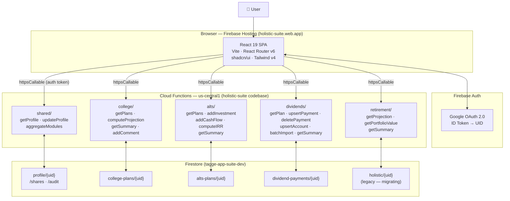
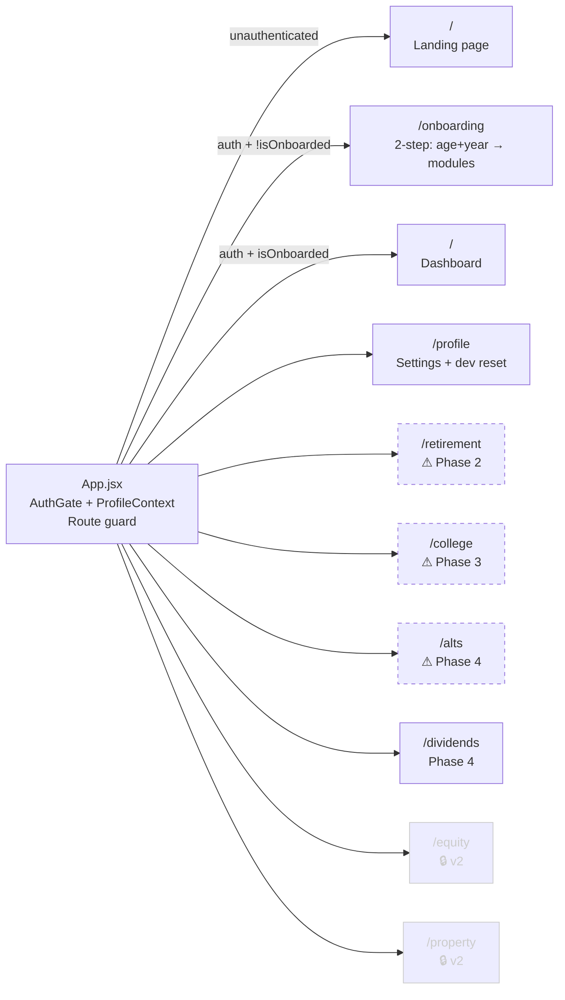
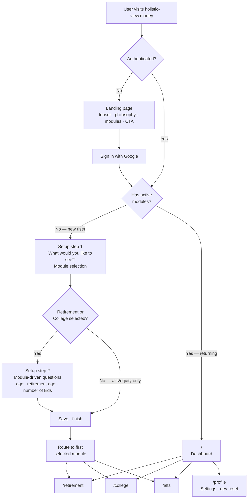
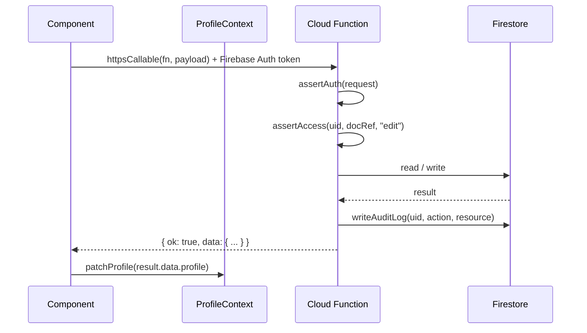
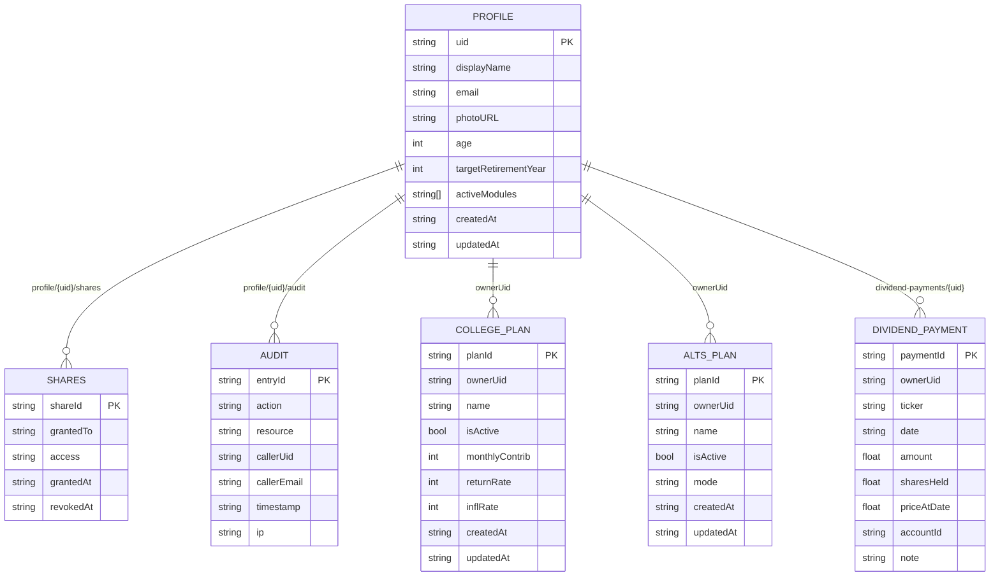
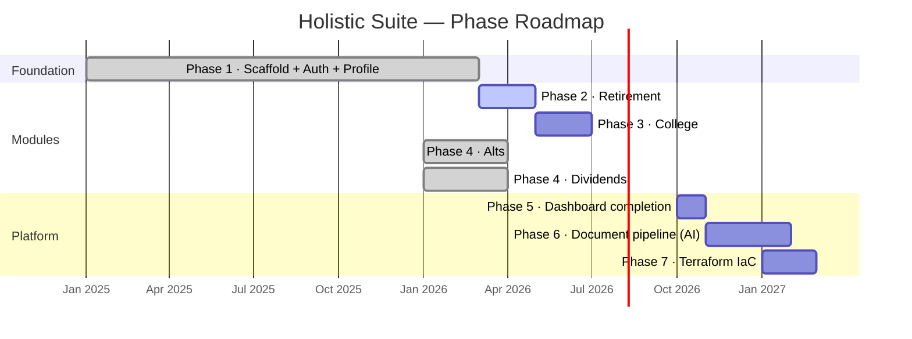

# Holistic Suite — Architecture

---

## System Topology

---

## Frontend Routing

---

## Page Flow

End-to-end user journey from first visit through active use.

---

## API Data Flow

Every component interaction follows this path. Components never read from or write to
Firestore directly.

---

## Firestore Data Model

---

## Module Build Status

